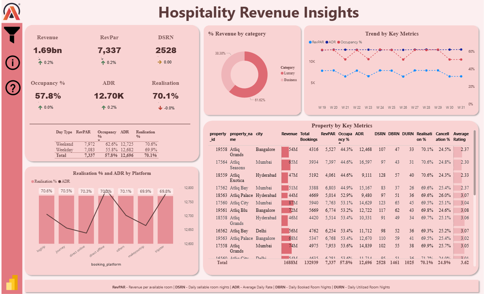

# Hospitality Revenue Insights

**Hospitality Revenue Insights** is a powerful Power BI dashboard created for **AtliQ Grand**, a premium chain of five-star hotels in major Indian cities (Mumbai, Hyderabad, Delhi, Bangalore).  

Facing declining revenue and market share, AtliQ Grand needed deep visibility into bookings, pricing, occupancy, and guest behavior. This dashboard delivers clear KPIs, breakdowns, and trends to help the revenue team spot issues and drive actionable improvements.

**Live Dashboard:** [Click Here](https://app.powerbi.com/view?r=eyJrIjoiMGU5NWQyNTAtYmE2OS00YjI5LThkZGUtMmMwOWE5Y2M4YTRhIiwidCI6ImM2ZTU0OWIzLTVmNDUtNDAzMi1hYWU5LWQ0MjQ0ZGM1YjJjNCJ9)

## Features

- **Performance Overview** — High-level KPI snapshot including Total Revenue, RevPAR, Occupancy %, ADR, Realisation %, DSRN, and changes vs previous periods.
- **Revenue Breakdown** — Visual breakdowns of revenue share by hotel category via pie chart.
- **Trend Analysis** — Interactive line trends showing RevPAR, ADR, and Occupancy % movements over weeks, highlighting weekly fluctuations and patterns.
- **Property Insights** — Comprehensive table ranking properties by Revenue, Total Bookings, RevPAR, Occupancy %, ADR, DBRN, DURN, Realisation %, Cancellation %, and Average Rating.
- **Platform Performance** — Bar chart comparing Realisation % and ADR across booking platforms (logtrip, journey, direct online, direct offline, others, makemytrip, tripster), revealing platform efficiency and contribution.

## Key Highlights

1. **Tailored Revenue Dashboard**  
   Built to deliver targeted visibility into performance gaps and growth opportunities.

2. **Unified Data Integration**  
   Combined multiple sources (bookings, revenue facts, dimensions) into a clean, relational model for seamless analysis.

3. **Advanced Metrics & Visuals**  
   Leveraged DAX to calculate hospitality-specific KPIs like RevPAR, ADR, Occupancy %, DBRN/DSRN, and interactive visuals for deep dives.

4. **Optimization Recommendations**  
   Identified key drivers (e.g., high cancellations, underperforming properties/channels) to guide pricing, promotions, and operational tweaks.

5. **Strategic Decision Support**  
   Empowered management to reverse revenue decline, regain market share, and boost profitability through evidence-based actions.

## Data Sources

The dashboard pulls from:
1. **Excel/CSV Files** — Booking details, revenue transactions, cancellation data, and platform references.
2. **MySQL Database** — Structured fact and dimension tables for properties, cities, room classes, dates, and guest metrics.

## Tech Stack Used

- Microsoft Power BI (Desktop & Service)
- DAX (Data Analysis Expressions) for advanced calculations (RevPAR, ADR, etc.)
- Power Query (for data cleaning and transformation)
- MySQL Database
- Excel / CSV handling
- Hospitality domain knowledge (ADR, RevPAR, Occupancy %, DBRN, DSRN)

## Screenshots

## Links 🔗

&nbsp;&nbsp;

Cheers! 🚀
